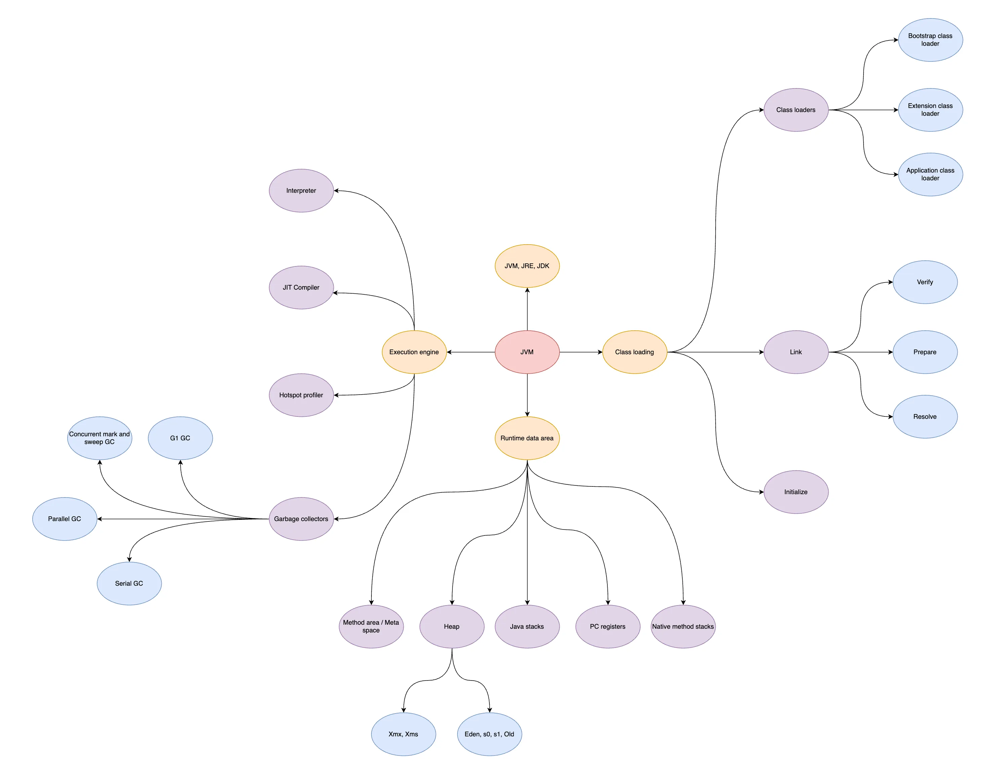
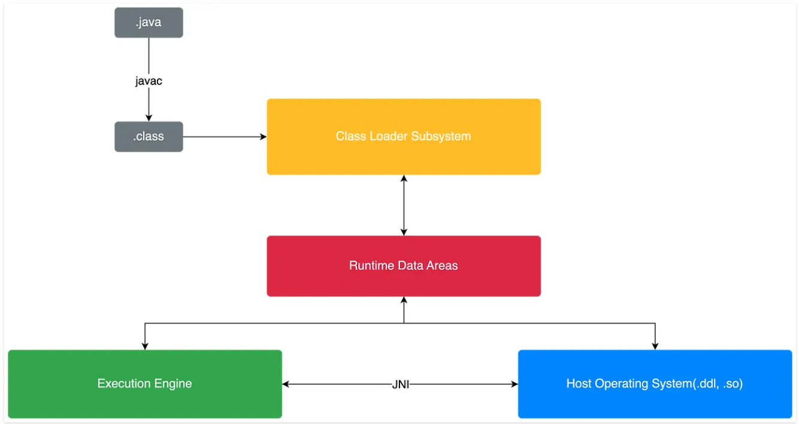
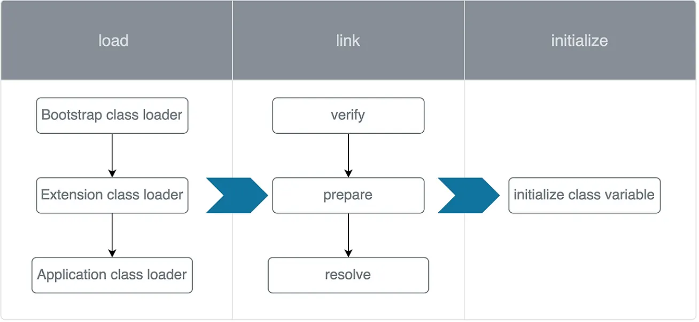

# JVM Deep Dive



## 1. Java

> "write once, run anywhere” 의 철학을 지닌 프로그래밍 언어

- `javac`(자바 컴파일러)에 의해 컴파일된 `.class` 코드가 동일하더라도 해당 코드는 서로 다른 운영체제 위에서 실행될 수 있다.
- JVM 내부의 interpreter가 운영체제가 이해할 수 있는 코드로 변환해 주기 때문.
  - 즉 java는 운영체제가 이해할 수 있는 코드를 작성하는 책임을 프로그래머로부터 JVM으로 전이한 것.

### 1.1. JDK, JRE, JVM

- **JVM**
  - Java의 .class 파일이 실행돌 수 있는 환경.
  - .class 파일의 bytecode가 host 운영체제 위에서 실행될 수 있는 환경을 제공.
- **JRE (Java Runtime Environment)**
  - 자바 프로그램이 실행될 수 있는 최소한의 환경.
  - JVM뿐 아니라 java 프로그램을 실행시키는데 필요한 라이프러리와 소스 포함.
- **JDK (Java Development Kit)**
  - JRE와 JVM을 모두 포함하는 구조.
  - javac, debugger 등 개발을 위한 도구를 포함.

## 2. Java의 실행 원리



.java 파일은 어떻게 동작할까?

- .java 파일은 javac에 의해 .class 파일로 컴파일된다.
- 컴파일된 .class 파일은 JVM의 class loader에 의해 JVM의 메모리 영역에 로딩된다.
- JVM 메모리에 로딩된 후 excution engine의 interpreter에 의해 코드가 운영체제가 이해할 수 있는 기계어로 변환된다.
- 이를 운영체제의 적절한 함수를 호출하여 필요한 로직을 수행.

### 2.1. Class Loader Subsystem



Class Loader Subsystem의 주목적은 자바 프로그램을 실행시키기 위해 필요한 class를 찾아서 JVM의 메모리에 로드하고 연결(link) 하기 위함이다. 필요한 class를 로드하고 연결하는 것 이외에 class variable을 초기화하는 역할도 수행.

#### 2.1.1. Load (Class Loaders)

Java 프로그램 실행에 필요한 class를 JVM에 로드하기 위해서 class loader를 활용.

클래스 로더는 “.class”파일을 사용하여 해당 바이너리 데이터를 생성하고 **메서드 영역**에 저장한다.

- 로드된 클래스와 그 직계 상위 클래스의 완전한 정규명.
- “.class” 파일이 클래스, 인터페이스 또는 열거형과 관련된 것인지 여부.
- Modifier, Variables and Method information etc.
  - 수식자, 변수 및 메서드 정보 등

1. **Bootstrap class loader**
   - JVM이 실행될 때 해당 java 프로그램 실행에 필요한 기본적인 class들을 로드한다.
     - (rt.jar 파일 내의 java.lang 등.)
   - native 코드로 구현되며 **자바 객체**가 아니다.
2. **Extension class loader**
   - Extension class들을 로드한다. (주로 `JAVA_HOME/jre/lib/ext`에 위치)
   - Extension class는 JDK가 추가적으로 제공하는 라이브러리.
3. **Application class loader**
   - classpath에 설정된 class를 로드.
   - `java.class.path` 환경변수로 지정된 경로에서 로드
   - 프로그래머는 실행시키고자 하는 java 프로그램의 classpath를 명시할 수 있음.

```
🚨 JVM은 위임 계층 구조 원칙에 따라 클래스를 로드한다.

부트스트랩 클래스 로더 ❌ → 확장 클래스 로더 ❌ → 어플리케이션 클래스 로더 ❌

⇒ java.lang.ClassNotFoundException 발생!!!
```

#### 2.1.2. Link

.class 파일 내의 symbolic references를 실제 메모리 주소로 변환하는 작업을 수행.

1. **Verify**
   - .class 파일이 java 스펙에 맞는지 검증.
     - 즉, 이 파일이 올바른 형식으로 유효한 컴파일러에 의해 생성되었는지 여부를 확인.
   - Bytecode format, version number 등을 확인하는 단계.
   - _검증에 실패하면 `java.lang.VerifyError`_ 에러 발생
2. **Prepare**
   - `class static variable`을 위한 메모리를 할당
   - ✅ static variable이 default 값으로 초기화 됨
     - 예를 들어 boolean 타입의 static 변수를 true로 설정해도 prepare 단계에서는 해당 변수는 false로 초기화 된다!
3. **Resolve (해석)**
   - symbolic reference를 실제 메모리 주소로 변환
   - 자바 바이트 코드(.class)에는 상수 풀(Constant Pool) 영역이 존재한다.
     - 여기에 클래스 이름, 메서드 이름, 필드 이름 같은 정보가 **문자열(심볼)** 형태로 저장됨.
     - ✅ 이것이 진짜 주소(메모리 주소)가 아니라 **심볼 기반 참조**이다.

```
Symbolic reference

- 우리가 코드를 작성하면서 사용한 class, field, method의 이름을 지칭한다.
- Resolve 단계는 class, field, method 그리고 constant pool의 symboic references를 실제 메모리 주소로 변환한다.
```

#### 2.1.3. Initialize

- **Static initializer block**을 실행한다.
- 위 link의 prepare 단계에서는 static 변수가 default 값으로만 초기화됐지만 initialize 단계에서는 프로그래머가 지정한 값으로 static 변수가 설정된다.
- Initialize가 완료된 이후 `main 메서드`가 실행된다.
