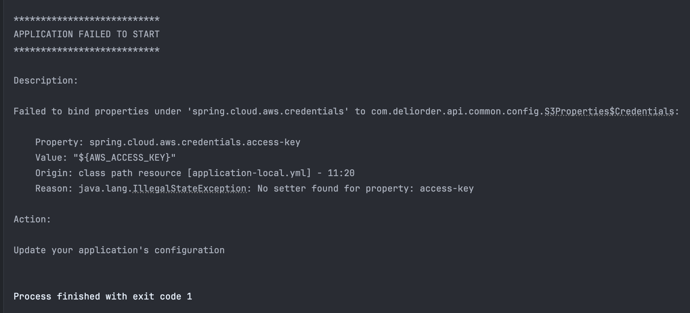

# [Spring Boot] 프로퍼티 값 주입 방법 비교 (@Value vs @ConfigurationProperties)

> `application.yml`, `application.properties` 등의 설정 파일로부터 값을 읽어와서 스프링 빈에 주입하기 위해서
> `@Value`와 `@ConfigurationProperties`를 사용할 수 있다.

## @Value vs @ConfigurationProperties

| 구분      | @Value                                                                                             | @ConfigurationProperties                                                                                                                                        |
| --------- | -------------------------------------------------------------------------------------------------- | --------------------------------------------------------------------------------------------------------------------------------------------------------------- |
| 목적      | 단일 속성 주입 <br> 예: `@Value("${cloud.aws.s3.bucket}")` <br> → 환경변수 `AWS_S3_BUCKET` 값 하나 | 다수의 속성 주입 <br> 예: `@ConfigurationProperties(prefix = "cloud.aws.s3")` <br> → s3 아래 모든 속성 매핑 (`AWS_S3_BUCKET`, `AWS_S3_PRESIGNED_EXPIRATION` 등) |
| 주입 방식 | 필드 주입만 가능 <br> (`final` 사용 불가)                                                          | 생성자 주입 가능 <br> (`final` 사용 가능)                                                                                                                       |
| 이름 매핑 | 직접 지정해야 함                                                                                   | Spring Boot가 자동 매핑 <br> `kebab-case` → `camelCase` 변환 <br> 예: `presigned-url-expiration` → `presignedUrlExpiration`                                     |

## @ConfigurationProperties 사용 방식



→ @ConfigurationProperties를 사용할 때는 바인딩을 위해 setter 방식 또는 생성자 방식 중 하나를 사용해야 한다.

### 1. @Setter 방식

```
@Getter
@Setter
@ConfigurationProperties("spring.cloud.aws")
public class S3Properties {

    private String region;
    private Credentials credentials;
    private S3 s3;

    @Getter
    @Setter
    public static class Credentials {
        private String accessKey;
        private String secretKey;
    }

    @Getter
    @Setter
    public static class S3 {
        private String bucket;
        private Long presignedUrlExpiration;
    }
}
```

- 기본 생성자와 setter를 통해 바인딩

### 2. 생성자 바인딩 방식 (Spring Boot 3.x 기준)

```
@Getter
@RequiredArgsConstructor
@ConfigurationProperties("spring.cloud.aws")
public class S3Properties {

    private final String region;
    private final Credentials credentials;
    private final S3 s3;

    @Getter
    @RequiredArgsConstructor
    public static class Credentials {
        private final String accessKey;
        private final String secretKey;
    }

    @Getter
    @RequiredArgsConstructor
    public static class S3 {
        private final String bucket;
        private final Long presignedUrlExpiration;
    }
}
```

- Spring Boot 3.0 이상에서는 @ConstructorBinding 없이도 생성자가 하나뿐이라면 자동으로 생성자 바인딩이 적용됨
  - 공식 문서 내용 중 - there is no need to use @ConstructorBinding.
- final 필드를 사용할 수 있어 불변 객체로 관리 가능

## 등록 방법

@ConfigurationProperties를 사용한 클래스는 스프링 컨테이너에 등록되어야 바인딩이 적용 가능

### 1. @Component 직접 사용

```
@Getter
@Component
@RequiredArgsConstructor
@ConfigurationProperties("spring.cloud.aws")
public class S3Properties {

    private final String region;
    private final Credentials credentials;
    private final S3 s3;

    @Getter
    @RequiredArgsConstructor
    public static class Credentials {
        private final String accessKey;
        private final String secretKey;
    }

    @Getter
    @RequiredArgsConstructor
    public static class S3 {
        private final String bucket;
        private final Long presignedUrlExpiration;
    }
}
```

- @Component로 직접 빈 등록 → 바로 다른 서비스에 주입 가능
  - @Component: 스프링 빈으로 등록
  - @ConfigurationProperties: 외부 설정을 바인딩
  - → 두 역할이 한 클래스에 동시에 주어져, 설정 클래스가 빈 등록과 바인딩 책임을 모두 지게 됨
  - → 단일 책임 원칙(SRP) 위반 가능
- 생성자 바인딩 방식과 어울리지 않음
  - @Component 방식은 기본적으로 기본 생성자 + setter 주입을 전제로 동작하기 때문
  - @Component를 붙이면 Spring이 내부적으로 빈 생성 시 기본 생성자를 호출한 뒤, setter로 값을 주입
  - → final 필드는 주입 불가 → 불변 객체 설계 불가

### 2. @ConfigurationPropertiesScan 또는 @EnableConfigurationProperties 사용

- 생성자 바인딩 방식에 적절함 → 불변 객체 사용 가능
- Spring 공식 문서에서 권장하는 방법
- 설정 클래스와 빈 등록 책임이 분리됨 → SRP(단일 책임 원칙) 만족
- @ConfigurationPropertiesScan
  - @ConfigurationProperties 클래스 자동 등록

```
@ConfigurationPropertiesScan
@SpringBootApplication
public class DeliorderApplication { ... }
```

- @EnableConfigurationProperties
  - 명시적으로 클래스를 지정해 등록

```
@EnableConfigurationProperties(S3Properties.class)
@SpringBootApplication
public class DeliorderApplication { ... }
```

## 📝 결론

- 설정값이 많은 경우에는 @ConfigurationProperties를 사용해 구조화된 방식으로 관리
- @ConfigurationProperties를 사용 할 때, 바인딩을 위해서 다음 중 하나를 사용해야 한다:
  - @Setter 방식 (기본 생성자 + setter)
  - 생성자 바인딩 방식 (final 필드 + 생성자 → 불변 객체 설정)
- Spring Boot 3.x 이상에서는 @ConstructorBinding 없이도 생성자 하나만 있으면 자동 바인딩 됨
- 설정 값을 불변 객체로 사용할 경우에는 생성자 바인딩 방식 사용이 적합
- @ConfigurationPropertiesScan로 등록해서 사용

✅ 설정값이 많고 구조화가 필요한 경우, @ConfigurationProperties + 생성자 바인딩 방식을 추천합니다.

## 🏷️ Reference

- https://docs.spring.io/spring-boot/reference/features/external-config.html#features.external-config.typesafe-configuration-properties

- https://mannakingdom.tistory.com/144
